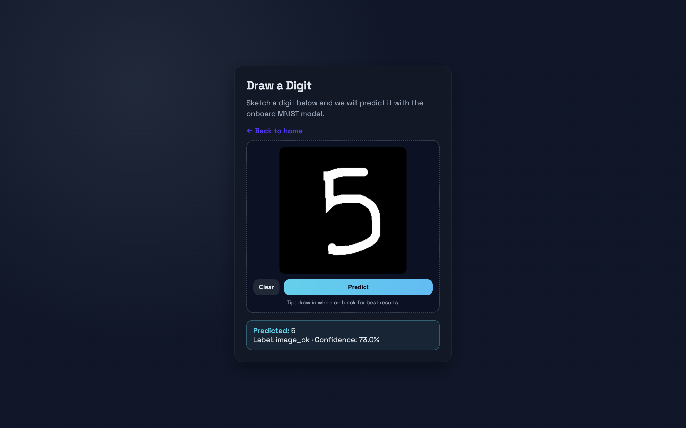

# mlops-vision-service

FastAPI service for MNIST-style digit prediction with a lightweight UI. Built for Python 3.11 with src layout, linting, typing, tests, Docker image, and a Hugging Face Spaces-ready Dockerfile.

## Quickstart (local)

```bash
make install          # create venv, install deps, pre-commit
make api-run          # start uvicorn on :8000 (reload)
```

Then open:
- API docs: http://localhost:8000/docs
- Web UI (draw/upload): http://localhost:8000/predict_digit
- Live demo (Render): https://mlops-vision-service.onrender.com/



## API

- `POST /predict` (json or multipart) → PredictResponse
- `POST /predict_digit` (multipart file `image`) → PredictResponse
- Health: `/healthz`, `/livez`, `/readyz`

`tests/test_api.py` exercises the happy paths:

```bash
make test
```

## Web UI

`/predict_digit` serves `predict_digit_draw.html`: draw a digit (mouse/touch) or upload and see the predicted class/label/confidence. A minimal home page at `/` links to it.

## Docker

Build and run locally:

```bash
make docker-build                 # builds mlops-vision-service:dev
docker run -d --name mvs -p 7860:7860 mlops-vision-service:dev
curl http://localhost:7860/readyz
```

The image runs `uvicorn mlops_vision_service.api:app` and exposes `${PORT:-7860}`. Model and HTML assets are packaged in the wheel.

## Publish to GHCR

```bash
docker tag mlops-vision-service:dev ghcr.io/<user>/mlops-vision-service:latest
echo "$GHCR_PAT" | docker login ghcr.io -u <user> --password-stdin
docker push ghcr.io/<user>/mlops-vision-service:latest
```

## Hugging Face Space

`mlops-vision-service/Dockerfile` is a Space-ready wrapper that pulls the GHCR image and runs uvicorn on `$PORT` (default 7860). Point your Space to the pushed image or let it build from the repo.
